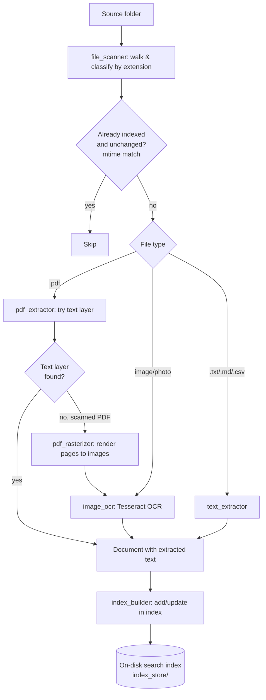
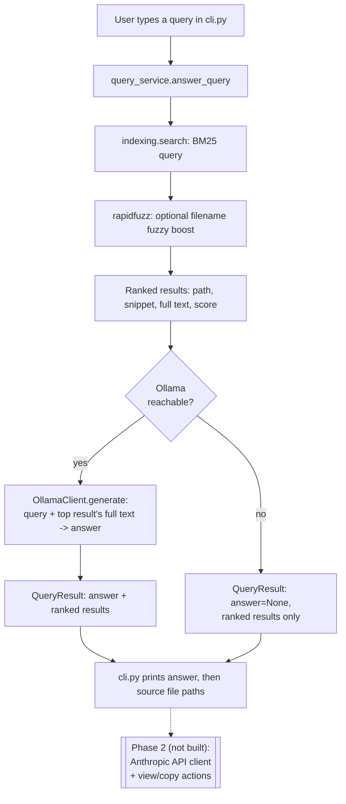

# DocSearchChatbot — Design

## 1. Overview

DocSearchChatbot searches a local folder of personal documents — plain text
files, PDFs, pictures, and scanned/photographed document images — and
returns the file(s) matching a natural-language-style query. Nothing is
uploaded anywhere; extraction, indexing, and search all run locally.

## 2. Scope boundary

**Phase 1 (this document, built now):**
- Ingest all 4 document types from a source folder.
- Extract text (native for text files/PDFs, OCR for images and scanned PDFs).
- Build a local full-text search index.
- CLI that takes a query, finds the matching file(s), and — using a local
  Ollama LLM reading the extracted text — answers the query directly (e.g.
  the actual HSA dollar figure off a W2), always alongside the source file
  path(s) so the answer is checkable. If Ollama isn't running, the CLI
  falls back to just returning matching file paths + snippets.

**Phase 2 (separate, future, not built now):**
- Anthropic API as an alternative, swappable `LLMClient` (higher accuracy,
  paid) — the interface already supports this, only a concrete client is
  deferred.
- File view / copy-to-folder actions.
- Google Docs/Drive search.
- A GUI (e.g. Streamlit) in place of the CLI.

**Why Ollama moved into Phase 1 but Anthropic stayed in Phase 2:** the
original file-paths-only Phase 1 was scoped to prove out ingestion/OCR/
indexing before adding any answer-generation layer, not to avoid cost —
Ollama is free either way. Since it's free, the user chose to fold it in
now rather than defer it. The Anthropic API stays deferred because it's a
paid, separate-billing alternative, not because it's technically harder.

## 3. Architecture overview

Four components, wired together only by `cli.py`:

- **`ingestion/`** — turns files on disk into `Document` objects (path +
  extracted text + metadata). One module per document type/concern.
- **`indexing/`** — builds and queries a local full-text (BM25) search
  index from a stream of `Document` objects.
- **`llm/`** — an `LLMClient` interface (`base.py`) plus one concrete
  implementation, `OllamaClient` (`ollama_client.py`), that calls a local
  Ollama server. A future Anthropic client (Phase 2) implements the same
  interface with no changes needed elsewhere.
- **`query/`** — thin orchestration: `answer_query(text) -> QueryResult`,
  where `QueryResult` holds an optional LLM-generated `answer` plus the
  ranked `results` (paths/snippets) it was grounded in. Returns data only,
  never prints — so a future GUI can call the exact same function as the
  CLI.

`cli.py` is the only place that prints or reads input; it calls
`index_builder` (to reindex) and `query_service` (to search).

## 4. Ingestion & indexing flow

## 5. Query flow

## 6. Data model

| `Document` (ingestion) | Whoosh schema field (indexing) |
|---|---|
| `path: Path` | `path` (stored, unique ID) |
| `filename: str` | `filename` (indexed, boosted) |
| `doc_type: str` | `doc_type` (stored) |
| `text: str` | `content` (indexed AND stored, so the full text can be handed to the LLM, not just a snippet) |
| `mtime: float` | `modified_time` (stored, used for incremental skip) |

## 7. Config & privacy

- `SOURCE_DOCS_DIR` (the user's real document folder) and `INDEX_DIR`
  (where the on-disk index lives) are set in `config.py`, both configurable
  via environment variables, and both stay **outside** version control.
- `OLLAMA_HOST` (default `http://localhost:11434`) and `OLLAMA_MODEL`
  (default `llama3.1`) are also set in `config.py`, env-var-overridable.
  Extracted document text sent to Ollama stays on the local machine — the
  Ollama server runs locally, nothing is sent to a remote API in Phase 1.
- `index_store/` (the default `INDEX_DIR`) is excluded via the workspace
  `.gitignore` — it contains extracted text from personal documents (birth
  certificates, bank statements, W2s) and must never be committed.
- Source documents themselves are never copied into the repo.

## 8. Non-functional notes

- **Incremental reindexing:** a file is only re-extracted/re-indexed if its
  `mtime` differs from what's stored in the index.
- **Error handling:** unreadable or corrupt files are logged and skipped;
  one bad file never aborts a full reindex run.
- **Logging:** basic logging (file processed, OCR fallback triggered, file
  skipped/errored) to stdout.

## 9. Out of scope for Phase 1

- Anthropic API as an LLM backend (the interface supports it; only the
  concrete client is deferred to Phase 2).
- Google Docs/Drive search.
- Any GUI.
- File view / copy-to-folder actions.

## 10. Appendix — library choices & cost

| Concern | Library | Install | Cost |
|---|---|---|---|
| Plain text (.txt/.md/.csv) | stdlib | built-in | $0 |
| PDF text-layer extraction | `pypdf` | pip | $0 |
| Scanned-PDF page rasterization | `PyMuPDF` (`fitz`) | pip | $0 (AGPL-3.0, fine for personal use) |
| Image OCR | `Pillow` + `pytesseract` | pip | $0 |
| OCR engine | Tesseract OCR (UB-Mannheim build) | system installer | $0, one-time |
| Fuzzy filename matching | `rapidfuzz` | pip | $0 |
| Full-text search & ranking | `whoosh` (or actively-maintained fork) | pip | $0 |
| Local LLM answer generation | `ollama` (official Python client) + Ollama app (system install) + a pulled model, e.g. `llama3.1` (~4.7GB) | pip + system installer + one-time model download | $0, runs entirely on your machine |

Phase 1 has zero ongoing API cost — Ollama runs locally and is free. Phase 2
adds the Anthropic API as an alternative, higher-accuracy `LLMClient`: it's
billed separately at console.anthropic.com (a claude.ai Pro/Max chat
subscription does not cover API usage), while Ollama remains the zero-cost
option.
